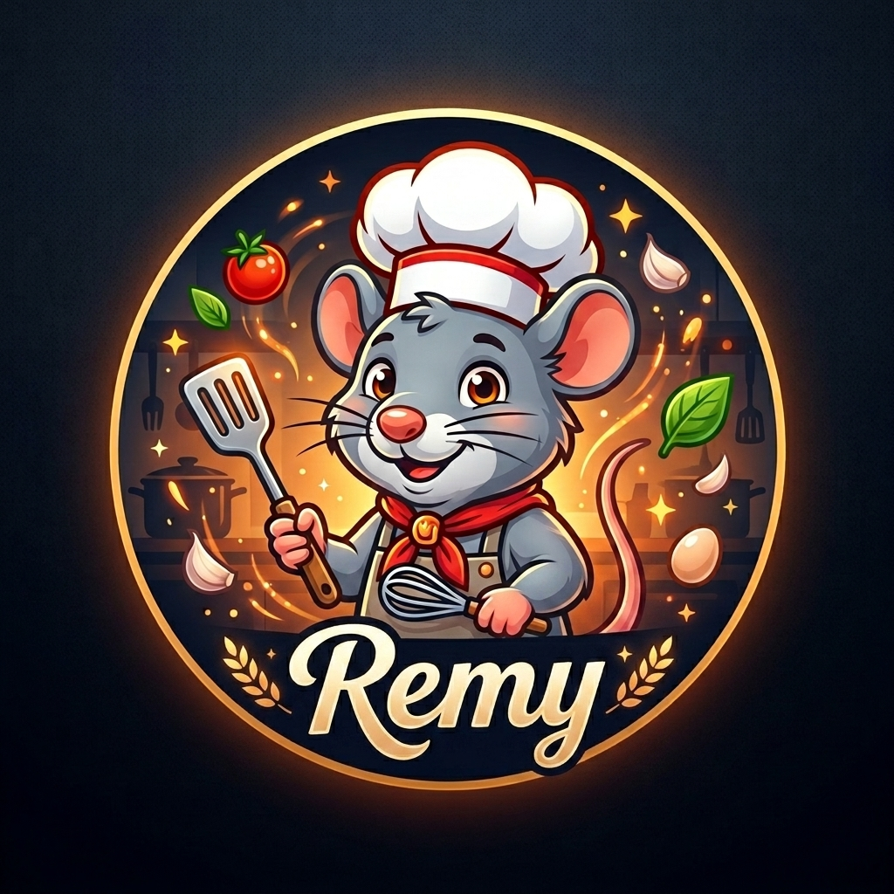

<p align="center">
  
</p>

<h1 align="center">Remy</h1>

<p align="center">
  <strong>A tiny AI that lives near a fridge, stares at its contents, and figures out what to make for dinner.</strong>
</p>

<p align="center">
  
  
  
  
  
</p>

---

## The Idea

The refrigerator stare is a universal human experience. Door opens, eyes glaze over, door closes. Nothing was accomplished.

Remy is a local AI appliance running on a **Jetson Orin Nano Super** tucked somewhere near the refrigerator. It takes a photo of the fridge interior, identifies what's in there, and generates a dinner recipe using only what it sees — delivered via Telegram like a tiny chef that lives in the kitchen wall.

No cloud APIs. No subscriptions. No uploading photos of sad leftovers to a server farm. Everything runs locally.

## How It Works

The pipeline is pretty straightforward:

```
Camera -> VLM (vision model) -> Chef LLM -> Telegram
```

1. A camera captures a still of the fridge interior (or you send a photo via Telegram).
2. A vision-language model (VLM) looks at the image and produces a list of ingredients it can identify.
3. A chat LLM plays the role of a practical home chef and generates a dinner recipe using those ingredients, deliberately avoiding whatever it suggested recently.
4. The recipe lands in Telegram.

You can also send a fridge photo directly in Telegram — caption it `/recipe` for a full recipe or `/scan` for ingredients only. The image is downloaded to the Jetson and processed locally by Ollama; text commands `/recipe` and `/scan` still use the mounted camera when no photo is attached.

There's also a SQLite memory layer that keeps track of past recipes so it doesn't suggest the same broccoli stir-fry three nights in a row.

Both models run locally via **Ollama** — which means the whole thing works offline, and the fridge contents stay private.

## The Stack

| Piece | What it does |
|---|---|
| Jetson Orin Nano Super | Runs everything — compute, camera, models |
| Ollama | Local model server (wraps llama.cpp) |
| Qwen3-VL 2B | The VLM — looks at the fridge photo, names what it sees |
| Ministral 3B | The chef — turns ingredient lists into recipes |
| python-telegram-bot | Two-way Telegram interaction |
| SQLite | Keeps recipe history |

## Project Structure

```
remy/
├── config.py       # env vars + per-model prompt registry
├── vision.py       # VLM wrapper → ingredient list
├── chef.py         # chat LLM wrapper → recipe
├── memory.py       # SQLite (recipes, ratings, history)
├── camera.py       # image capture (Jetson) or fixture loader (dev)
├── orchestrator.py # linear pipeline tying it all together
├── bot.py          # Telegram bot + scheduled daily scan
└── debug_cli.py    # local REPL for testing without Telegram or a camera
```

## Development on a Mac

The intended target is a Jetson, but the whole pipeline (minus the camera and Telegram) can be exercised locally. The debug CLI calls the same [`orchestrator.py`](remy/orchestrator.py) pipeline as the Telegram bot.

```bash
# 1. Create the virtual environment
python3 -m venv .venv

# 2. Activate it (run this every new shell session)
source .venv/bin/activate

# 3. Install deps
pip install -r requirements.txt

# 4. Pull the models (Ollama must already be installed and running)
ollama pull qwen3-vl:2b
ollama pull ministral-3:3b

# 5. Copy config and fill in model names
cp .env.example .env

# 6. Launch the debug CLI
python -m remy.debug_cli
```

For production deployment to a Jetson Orin Nano Super, see [DEPLOYMENT.md](DEPLOYMENT.md).

Inside the CLI:

```
/scan path/to/fridge.jpg      → run only the VLM, see what it finds
/recipe path/to/fridge.jpg    → full pipeline end-to-end
/ingredients "milk, eggs"     → test the chef directly, no image needed
/last                         → see the most recent recipe from memory
/feedback 1 5                 → rate recipe #1 with 5 stars
```

### Telegram photo input

When the bot is running, you can send a fridge photo from your phone:

```
Photo captioned /recipe   → full pipeline using that image
Photo captioned /scan     → VLM only, returns ingredient list
```

Uncaptioned photos are ignored. This is useful for testing without a mounted camera or when you're away from the Jetson.

### Running tests

Unit tests use pytest and stdlib mocks — no Ollama, camera, or Telegram required:

```bash
pip install -r requirements-dev.txt
pytest tests/unit -q
```

## Status

Hobby project in active development. Currently standing up the core pipeline and testing model interactions before putting anything inside an actual fridge.

v1 goal: camera fires → recipe lands in Telegram. That's it.
